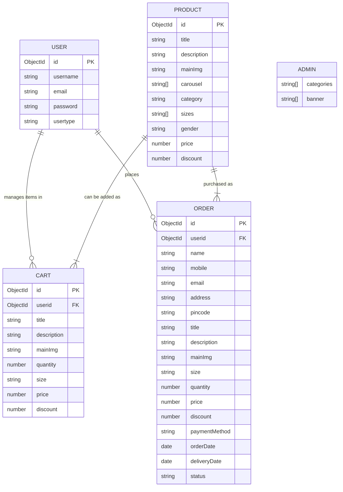

# ShopEZ - Premium E-Commerce Platform

ShopEZ is a massive full-stack e-commerce web application built with the MERN (MongoDB, Express, React, Node.js) stack. It provides an intuitive interface to browse products, add items to a shopping cart, place orders, and manage inventory.


## 💾 Database ER Model



---


## 🚀 Features

* **User Authentication**: Secure login and registration using JWT authentication and bcrypt password hashing.
* **Live Market View**: Browse a curated list of top stocks. Cards feature dynamic company logos fetched automatically based on the stock symbol.
* **Stock Details**: View historical price charts, absolute and percentage price changes, and detailed company metrics.
* **Trading Engine**: Simulate buying and selling shares with real-time portfolio balance validation.
* **Portfolio Management**: Track your total investment, current value, total profit/loss, and view a breakdown of asset allocation via dynamic doughnut charts.
* **Admin Dashboard**: Dedicated portal for administrators to manage the platform.
* **Theming**: Integrated Light/Dark mode toggle via context API, featuring premium UI elements, glassmorphism, and responsive design.

---


## 🛠️ Technology Stack

**Frontend**
* **Framework:** React (Bootstrapped with Vite)
* **Routing:** React Router v7
* **Styling:** Vanilla CSS (CSS Variables for dynamic theming)
* **Charts:** Chart.js & react-chartjs-2
* **Icons:** react-icons
* **HTTP Client:** Axios
* **Avatars:** unavatar.io & ui-avatars.com (Dynamic Fallbacks)

**Backend**
* **Runtime:** Node.js
* **Framework:** Express.js
* **Database:** MongoDB & Mongoose
* **Authentication:** JSON Web Tokens (JWT) & bcryptjs
* **Environment Configuration:** dotenv
* **CORS Management:** cors

---

## 📦 Project Structure

The project is structured as a monorepo containing both the frontend and backend.

```
shopEZ/
├── client/           # React Frontend Application
│   ├── public/
│   └── src/          # React Components, Pages, Context, API hooks
└── server/           # Node.js Express Backend API
    ├── models/       # Mongoose Schemas (User, Stock, Portfolio, Transaction)
    ├── routes/       # Express Route Handlers
    ├── middleware/   # Authentication & Error Handling
    └── seed.js       # Database Seeding Utility
```

---

## 💻 Getting Started

### Prerequisites
Make sure you have the following installed on your local machine:
* [Node.js](https://nodejs.org/) (v16.x or higher)
* [MongoDB](https://www.mongodb.com/) (Running locally or a MongoDB Atlas URI)

### 1. Clone the Repository
*(Assuming you are cloning this project or setting it up locally)*
```bash
git clone <repository-url>
cd shopEZ
```

### 2. Backend Setup
Navigate into the `server` directory, install dependencies, configure environment variables, and start the server.

```bash
cd server
npm install
```

**Environment Variables:**
Create a `.env` file in the `server` directory and add the following:
```env
PORT=5000
MONGO_URI=mongodb://127.0.0.1:27017/shopez # Or your MongoDB Atlas URI
JWT_SECRET=your_super_secret_jwt_key
```

***Seed Database (Optional):**
To populate the database with initial dummy stocks, run:
```bash
npm run seed
```

**Start the Backend Dev Server:**
```bash
npm run dev
```
*The server will run at http://localhost:5000.*

### 3. Frontend Setup
Open a new terminal window, navigate to the `client` directory, install dependencies, and start the Vite development server.

```bash
cd client
npm install
npm run dev
```
*The frontend will run at http://localhost:5173.*

---

## 📖 Usage Options

1. **Register** a new account with a starting balance (e.g., ₹100,000).
2. Visit the **Market** to view a list of available assets.
3. Click on any asset to view its **Price History Chart** and details.
4. Click **Buy** to simulate purchasing shares.
5. Navigate to the **Portfolio** tab to see your asset allocation and overall P&L.
6. Use the **Sun/Moon** icon in the navigation bar to switch the application theme.

---

## 🔒 Security Posture
* Passwords are encrypted in the database using `bcryptjs`.
* Protected API routes ensure JWT inclusion mapped correctly in headers (`Bearer <token>`).
* Protected Frontend routes safely redirect unauthenticated users back to the homepage/login.

## 📄 License
This project is for educational and portfolio demonstration purposes.

## 👨‍💻 Author

***Khushi Kumari***

Computer Science Engineering Student

Jai Narain College of Technology, Bhopal

MERN Stack Developer

